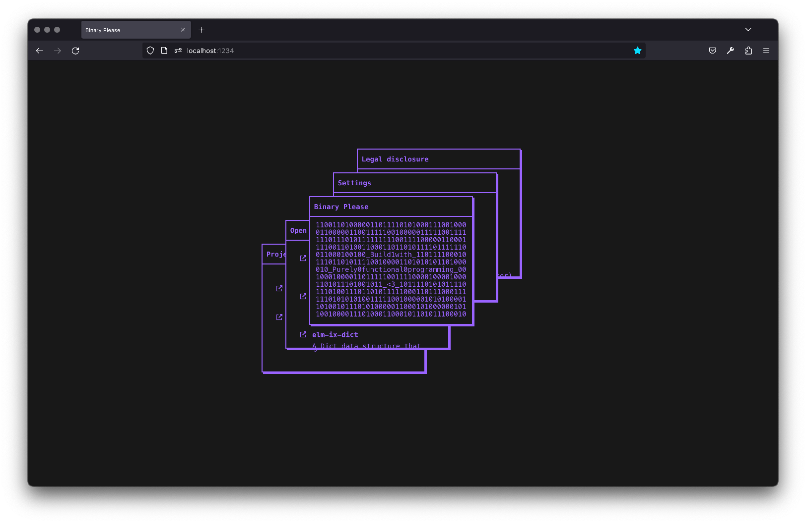

# elm-ui-window

Put some draggable, resizeable rectangles to your UI!



# Use cases

- A UI with window elements, i.e. [https://binaryplease.com/](https://binaryplease.com/)
- As a core package to work with resizable elements, as used in our map customizer at [https://www.hyhyve.com/](https://www.hyhyve.com/)
- A website builder
- Rendering flow charts

# Usage

You basically have this type...

```elm
type alias Window msg =
{ plane : Plane
, render : (Msg -> msg) -> Int -> Plane -> Element msg
}
```

...that you can use with three familiar functions: `initWith`, `update` and `view`.

That's it!

# Example

A fully working example would be:

```elm
type alias Model =
    { windowModel : Window.Model
    }


init : Model
init =
    { windowModel = Window.initWith windows
    }


type Msg
    = WindowMsg Window.Msg


update : Msg -> Model -> ( Model, Cmd msg )
update msg model =
    case msg of
        WindowMsg windowMsg ->
            let
                ( windowModel, windowCmds ) =
                    Window.update windowMsg model.windowModel
            in
            ( { windowModel = windowModel }, windowCmds )


view : Model -> Html Msg
view model =
    layout []
        -- Mount the view wherever you want
        (Window.view WindowMsg model.windowModel windows)


windows : List (Window.Window msg)
windows =
    [ -- A window is just a plane in xy space and some render fn to render the content inside that plane. That's it!
      { plane =
            -- A plane is a rectangle with a position and size
            { position = vec2 0 0
            , size = vec2 100 100
            }
      , render =
            -- A simple view render function. You don't have to use the `_ _ _` params, hence the `_`.
            \_ _ _ ->
                -- Just give it some border and you are good to go!
                el [ Element.Border.width 3 ]
                    (text "Hello, World!")
      }
    ]
```

# Advanced usage

In the simple example we ignored three params of the render function.
These three params actually are: `toMsg`, `index`, and `plane`. Let's see
how we can use them to create advanced views:

```elm
windows2 : List (Window.Window msg)
windows2 =
    [ { plane =
            { position = vec2 0 0
            , size = vec2 100 100
            }
      , render =
            \toMsg ix plane ->
                column
                    [ Element.Border.width 3

                    -- Use the toMsg to use the `onDrag` function to allow for you window to be dragged.
                    -- This can be whereever you like, either everywhere oder at dedicated area like a window title bar.
                    , onDrag toMsg ix
                    ]
                    -- Use the index and current plane state if you want to use them
                    [ text <| "index  = " ++ String.fromInt ix
                    , text <| "x      = " ++ String.fromFloat (getX plane.position)
                    , text <| "y      = " ++ String.fromFloat (getY plane.position)
                    , text <| "width  = " ++ String.fromFloat (getX plane.size)
                    , text <| "height = " ++ String.fromFloat (getY plane.size)
                    ]
      }
    ]
```

# Notes

You can find the example in `src/Window/Example.elm`.

This is work in progress and therfore not yet published on elm packages.


